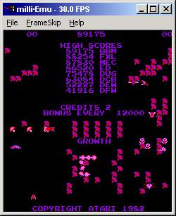



## milliEmu

### Description

Emulates the 6502-based Millipede arcade machine from the early-1980s.
 
### More Info
 
The original Millipede arcade ROMs and a healthy user.

You must have the Millipede arcade ROMs.

An emulated Millipede screen.

             |
---                |---
**Submitted On**   |2003-09-02 04:23:36
**By**             |[Don Jarrett](https://github.com/Planet-Source-Code/PSCIndex/blob/master/ByAuthor/don-jarrett.md)
**Level**          |Advanced
**User Rating**    |3.8 (19 globes from 5 users)
**Compatibility**  |VB 4\.0 \(32\-bit\), VB 5\.0, VB 6\.0
**Category**       |[Games](https://github.com/Planet-Source-Code/PSCIndex/blob/master/ByCategory/games__1-38.md)
**World**          |[Visual Basic](https://github.com/Planet-Source-Code/PSCIndex/blob/master/ByWorld/visual-basic.md)
**Archive File**   |[milliEmu163953922003\.zip](https://github.com/Planet-Source-Code/don-jarrett-milliemu__1-48169/archive/master.zip)

